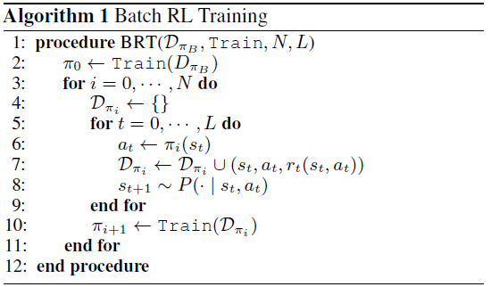
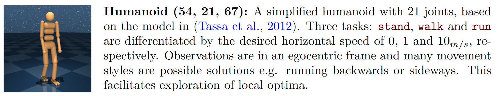

# Challenges of Real-world Reinforcement Learning
by [Dulac-Arnold et al., (2019)](http://arxiv.org/abs/1904.12901)
## I. 초서
### 0. Abstract
* 강화학습을 실제 시스템에 적용하기 위해서는 만족시켜야 할 가정들이 있지만, 이들은 실제 상황에서는 잘 만족되지 않는다.
* 강화학습을 실제로 적용하는데 있어 고려해야만 하는 9가지 문제를 명시화하고, 거기에 대한 기존의 해법들, 그 성과를 측정하는 지표들을 설명한다.
* 9가지 문제를 잘 보이기 위해 예제 문제 영역도 아울러 제시한다.
### 1. Introduction
* 강화학습의 성공 이면에는 이 알고리즘이 실제문제에 적용이 지지부진 하다는 현실이 존재한다.
* 이런 간극의 주요 이유는 현재 강화학습의 실험적 체계와 실제문제의 불명료한 정의 사이의 큰 차이에서 나온다.
* 여기선 강화학습의 실제 적용을 어렵게 하는 9가지 문제를 다음과 같이 정리하였다.
  1. 외부 행위정책의 고정된 지표에 의한 off-line training
  2. 실제 시스템을 제한된 샘플을 통해 학습하고자 하는 것
  3. 고차원의 연속적 상태, 행위 공간
  4. 침해되어서는 안 되는 안전 제약들
  5. 부분적으로 관찰 가능하고, non-staionary 혹은 stochastic 할 수 있는 과제들
  6. 불명료하고, 다목적적 혹은 위험에 민감한 보상함수
  7. 설명가능한 policies와 action을 선호하는 시스템 운영자들
  8. 시스템의 통제 빈도에 실시간으로 내려져야 하는 inference
  9. 시스템 실행자, 센서 혹은 보상에 있어 크거나 원인불명의 딜레이
* Hard and easy scenarios

  Property | Hard | Easy 
  --- | --- | --- 
  good simulator | X | O
  stochastic & non-stationary | O | X
  strong safty constraints | O | X
  expensive running | O | X
* 어떤 경우에는 시뮬레이터를 만든다는 것조차 너무 어려운 과제이며, 어떤 시스템은 모델링 하기에 너무 복잡하다.
* 가용한 시뮬레이터가 없다면, 학습이나 탐색 모두 실제 시스템에서 나온 데이터를 통해 이루어질 수 밖에 없다.
* 실제 문제들에서는 단순히 평균 보상값을 최대화하는 것이 부적절한 목표일 수 있다. 최악의 경우를 방지하는 것이 높은 평균치를 얻는 것보다 중요할 수 있으며, 보상함수의 부분적 요소들은 더 나은 trade-off를 위해 명시적으로 구분될 필요가 있을 수 있다.
### 2. Practical Challenges
### 2.1. Batch Off-line and Off-Policy Training
* 기본적인 off-line, off-policy 학습에서 학습과정은 배치 데이터를 통해 이루어진다.
*  behavior policy 하에서 생성되는 경험 데이터
* 일반적인 배치 기반 강화학습은 **Algorithm 1**을 따른다.

* 실제 환경에서 실행하지 않고 policy의 성능을 측정하는 것을 **Off-policy evaluation**이라고 부르며, 이 측정방식은 policy와 그 policy에 의한 상태 분포와의 차이가 커지면 커질수록 어려워진다.
* Off-policy evaluation에 대한 접근법들
  * Importance sampling [(Precup et al., 2000)](https://dl.acm.org/citation.cfm?id=645529.658134)
  * Doubly-robust estimators는 behavior policy와 학습중인 policy를 같이 조합하고 양쪽 환경으로부터 evaluation을 수행한다. [(Dudik et al., 2011](https://arxiv.org/abs/1103.4601); [Jiang and Li, 2015)](https://arxiv.org/abs/1511.03722)
  * Magic (Thomas & Brunskill, 2016), More robust doubly robust (Farajtabar et al., 2018)
* 최초정책, 는 시스템 기획자에 의해 결정되는 경우가 많고, 시스템이 제공해야 할 최소한의 성능을 그 policy가 만족시켜야 한다.
* 따라서 새로운 학습 알고리즘을 평가하고자 하는데 있어 중요한 지표가 바로 **warm-start performance**이며, 이 지표는 주어진 behavior policy의 경험 데이터를 이용해 최초로 얻어진다.
* 여러 배치 사이즈의 데이터와 다양한 성격의 behavior policies에 대한 warm-start performance 측정은 부족한 데이터, sub-optimal, overfit 한 상황에서도 유망한 초기 policy를 찾는데 도움을 줄 수 있다.
### 2.2. Learning on the Real System from Limited Samples
* 실제 시스템들은 학습환경과 평가환경을 구분하지 않으며, 때문에 에이전트는 학습 데이터를 어느 정도 낭비하지 않고 탐색이라는 행위를 할 수 없다.
* 따라서 실제 시스템들에서 탐색은 제한적이며, 그 결과 얻게 되는 데이터들의 분산은 크지 않게 된다. 게다가 실제 시스템의 인스턴스 수는 제한적이므로 분산환경에 의한 학습 방법의 적용이 어렵다.
* 이와 같은 이유로 실제 시스템의 데이터 효율성은 매우 나쁘므로, 보다 휴올적으로 학습 가능한 강화학습 방법론이 필요하다.
* 해결법들:
  * Model Agnostic Meta-Learning (MAML) (Finn et al., 2017): 확률분포 하의 학습과제에 집중하는 방법 (few-shot learning)
  * Bootstrap DQN (Osband et al., 2016): 샘플 효율성을 올리기 위해 Q-네트워크 앙상블을 톰슨 샘플링과 같이 이용한다.
  * Expert demonstration based methods
  * Model-based deep RL methods (Hafner et al., 2018; Chua et al., 2018)
* 데이터 효율성을 측정하는데 적합한 방법은 어느 정도의 성능을 얻는데 필요한 데이터 양을 보는 것이다.
  (2)
### 2.3. High-Dimensional Continuous State and Action Spaces
* 너무나 큰 상태 혹은 행위 공간의 문제는 실제적인 문제에선 흔히 나타난다. (예, 추천 시스템)
* Nearest neighbor 탐색 기반 접근 (Dulac-Arnold et al., 2015)
* Action Elimination DQN 접근: contextual bandit을 부적절한 행동들을 제외하는데 사용한다.
* 행위들이 서로 연관되어 있는 정보를 활용하면, 행위 공간의 크기를 크게 줄일 수 있다.
### 2.4. Satisfying Safety Constraints
* 실제 시스템은 자기 자신을 보호하기 위해 만족해야 하는 조건 혹은 제약들이 있는 경우가 많다.(예, 최저 배터리 용량)
* Constrained MDP(Altman, 1999) 모형에서는 이러한 안전 제약들이 자연스럽게 반영된다.(Dalal et al., 2018; Achiam et al., 2017)
* Constrained MDP는 다음과 같이 정의된 재약된 최적화 문제를 갖는다.
 &nbsp; 여기서 는 제약 에 대해 어떤 정첵 의 누적된 비용을 가리킨다. 상태나 행위에 대한 세세한 제약은 와 같이 표기된다.
* 실제 시스템에서 안전과 연관된 사건은 시스템 로그에서 매우 출현이 적다는 것이 강화학습에는 큰 문제가 된다. 많은 경우에 이 안전제약들은 시스템 매니저로부터 제대로 기술되지도 않는다.
* 하나의 대안은 budgeted MDPs (Boutilier & Lu, 2016;  Carrara et al., 2018)로 CMDP와 달리 여기서는 제약의 수준이 미리 고정되어 있다고 가정하지 않는다. 대신 policy가 제약수준의 함수로서 학습된다. 사용자는 보상 기대값과 제약의 수준 간의 trade-off를 살펴보고 주어진 데이터에 비춰 가장 알맞은 제약수준을 선택할 수 있다.
* 안전 제약에 초점을 맞춘 강화학습 연구들이 최근 등장하고 있는데, 학습 중에 안전성을 지키는 policy를 학습하고자 하는 접근들은 신경망에 safety layer를 추가함으로써 에이전트로 하여금 안전성 위반을 전혀 저지르지 않게 학습하게 한다. (Dalal et al., 2018; Pham et al., 2017)
* 또 다른 접근은 에이전트가 안전성 위반을 저지르는 것을 허용하지만 학습된 policy는 안전제약들을 따르도록 유도하는 전략을 쓴다. (Achiam et al., 2017;Tessler et al., 2018; Bohez et al., 2019)
* Safe policy learning with Lyapunov functions (Chow et al., 2018), Safe exploration strategies (Turchetta et al., 2016; Wachi et al., 2018), Probabilistic Goal MDP (Mankowitz et al., 2016)
* 측정에 도움이 되는 지표 (Dalal et al., 2018)

### 2.5. Partial Observability and Non-Stationarity
* 부분 관찰성 문제는 강화학습에서는 흔히 POMDP 프레임워크에 의해 모형화되며, 관찰 상태 에 대한 관찰함수 가 MDP에 추가된다.
* 부분 관찰성 문제를 다루는 한 가지 방법은 메모리 버퍼를 통해 에이전트의 history를 이용하는 것이며, 다른 방법은 에이전트에게 RNN을 부여해 히든 상태를 스스로 추적하게 하는 것으로 메모리 버퍼 없이도 좋은 성능을 보여주었다. (Hausknecht & Stone, 2015)
* 이미 학습된 policy를 실제 문제의 환경에 적용할 때, 상태정보가 부정확하거나 행동이 지연되거 하는 등의 노이즈가 심한 환경에서도 강건하게 작동하는 강화학습 프레임워크를 Robust MDP라고 부른다.
* Robust MDP에서 환경은 일반적인 MDP에서와는 달리 에이전트가 장기이익을 최소화하도록 상태이행을 제공한다. 이런 환경에서 학습된 에이전트의 policy는 worst case value function을 최대화하도록 학습하게 된다.

* 최근 연구들에서 Robust MDP를 통해 학습된 policy는 에이전트가 방해받는 악조건 속에서도 강건한 policy를 제공한다는 것이 드러났으며 (Tamar et al., 2014; Mankowitz et al., 2018;Shashua & Mannor, 2017), 보다 이런 악조건을 경감시킨 soft-robust 해결책도 제시된 바 있다. (Derman et al., 2018).
* Domain randomization과 system identification을 이용한 연구도 비슷한 효과를 보고한다. (Peng et al., 2018; Finn et al., 2017)
* 노이즈가 심한 환경들을 어떤 policy가 이겨내면서 문제를 해결하는지 평가하는 방법은 에이전트가 K개의 그런 환경들에서 얻은 각 기대 보상값의 평균을 구하는 것이다. (Mankowitz et al., 2018; Di Castro et al., 2012;Derman et al., 2018)

### 2.6. Unspecified and Multi-Objective Reward Functions
* 많은 실제 시스템들의 보상함수는 다목적적 혹은 다차원적이다. 단순한 보상함수는 복수의 부분적 보상함수의 전체적 지표일 뿐이기 때문에 보다 올바른 지표는 policy의 보상과 관련한 내부 trade-off를 이해할 수 있도록 개별 요소들을 분리해서 나타내야 한다.
* 이런 목적에 부합하는 지표가 바로 CVaR(Conditional Value at Risk) objective 로서, 이 측정치는 한 개의 보상 기대값이 아니라 특정 그룹별 보상 값의 분포를 이용한다. (Tamar et al., 2015b) 이는 policy의 worst-case performance를 향상시키는 것으로 나타났다.
* Distributional DQN도 보상값들의 분포 정보를 활용하며, 이런 측면에서 CVaR을 적용하고 있다고 볼 수 있다. (Bellemare et al., 2017)
* Inverse 강화학습과 같이 시범 데이터를 통해 보상함수를 복원하는 방법도 생각해볼 수 있으며, 주어진 보상함수를 새로운 환경에서 학습 중에 유추하는 방법도 시도할 수 있다.
* 기대 보상값에 대한 단순한 다목적 분석법은 보상값의 부분요소들의 선형조합이,  와 같다고 할때 수식 (6)과 같이 기대 보상값들을 벡터요소로 갖는 다목적 보상함수 벡터를 생각해볼 수 있다.

* 각기 다른 요인들(사용자, 테스크 등)의 분포들을 반영한 성능을 평가하기 위해서, 각 요인들의 알고리즘 성능을 독립적으로 평가하는 것이 필요하다. 아니면 CVaR return을 분석하거나 드물지만 최악인 보상 출현을 최소화하는지를 평가한다거나, '위험회피' 혹은 '위험선호'와 같은 행위선택을 에이전트가 하는지를 보는 평가방법도 존재한다.

### 2.7. Explainability
* 실제 시스템에 있어서 간과하지 말아야 할 사실은 그것이 사람에 의해 운영된다는 것이다. 사람은 시스템이 하는 일에 대해 확신을 가질 수 있어야 하고, 시스템 실패가 발생하면 그것의 원인에 대해 유추할 수 있어야 한다.
* 강화학습의 경우엔 특히 학습을 통해 얻은 결과인 policy가 취하는 의외의 행동이나 전략이 어떤 귀결을 가져올 것인지에 대해 시스템 운영자는 이해할 수 있어야 하고 실패할 경우 그것의 원인을 알 수 있어야 한다. 때문에 policy의 설명가능성(explainability)는 실제 시스템에게는 중요한 문제이다.
* Verma et al. (2018)은 도메인에 특화된 프로그래밍 언어를 사용하여 policy를 정의하는 방법을 통해 탐색 알고리즘이 policy network로 하여금 프로그램을 산출하도록 했다. 도메인 특화 언어는 검증가능하므로 산출되는 policy도 검증 가능하다는 것에 착안한 것이다.
* 그 외에도 신경망의 '의도(intent)'를 짐작하는 것이 상대적으로 용이한 모델 기반 강화학습도 거론되는데, 모형 기반 강화학습은 planning을 주요 학습채널의 하나로써 활용하므로 rollout과 같은 과정을 통해 현재 policy의 의도를 관찰하는 것이 용이하다.
* 이런 종류의 시스템애 대한 평가 혹은 성능 측정은 대부분 사람에 의한 직접평가가 주를 이룬다.

### 2.8. Real-Time Inference
* 준비된 강화학습 시스템을 서비스로 돌리기 위해서는 시스템의 실시간 inference가 시스템이 호출되는 빈도에 맞춰 시간지연 없이 제공되는 것이다. 
* 하지만 장시간의 planning을 요하는 모형 기반 강화학습과 같은 경우에 짧은 시간제약은 시스템에게 있어 성능을 제약하는 요인이 된다. 여기에 대한 기존의 공통적인 대안은 MCTS와 같이 rollout에 기반한 방법을 통해 보다 빠른 예측을 제공하는 것이다. (AlphaGo)

### 2.9. System Delays
* 모든 실제 시스템은 상태의 인지, 행동의 실행, 보상획득과 같은 과정에서 시간지연이 발생할 수 있다. 자율주행 시스템은 브레이크를 가동하고 실제로 동체가 멈추는데 걸리는 시간지연을 학습해야 하며, 아이템 추천 시스템은 추천 이후 주어지는 보상의 지연이 몇 주가 걸릴 수 있다.
* 보상의 지연과 같은 문제에 대처하는 흔한 대응법 하나는 중간과정에서 인위적인 보상 시그널을 활용하는 방법(reward shaping)이 있고, 또다른 방법 하나는 기억-기반 에이전트를 사용하는 것이다. 에이전트는 자신의 장기기억 능력을 활용해 보상의 출현시 앞서 멀리 있었던 상태나 행위들에도 알맞은 보상을 부여할 수 있다.
* Arjona-Medina et al. (2018)의 RUDDER 알고리즘은 지연된 보상을 먼 이전의 사건들에도 전달할 수 있게 하기 위해 return-equivalent MDP를 제안한다. 이 방법은 시간적으로 거리가 먼 사건들에도 공평하게 보상값을 분배하므로 보상의 지연 문제를 우회할 수 있다.
* 이런 문제에 있어서 강화학습 시스템의 성능을 평가하기 위해서는 시스템 지연의 성격 혹은 요소를 고려해서 해야 한다. 일례로 지연의 길이와 policy의 누적 보상값 사이의 상관관계와 같은 정보가 이런 시스템 지연에 대한 policy의 강건함을 평가하는데 이용될 수도 있다.

## 3. Example Environment

* 이 환경은 지금까지 열거했던 9가지 문제들을 구체적으로 예시하고 각 문제마다 적절한 평가방법을 제시하는 것을 보여주기 위함이다.
* Table 1. Safety constraints for the humanoid environment (variables: )

   Type  | Constraint 
  ------ | ----------  
  Static | Limit joint angles.   Enforce uprightness.   Avoid dynamic obstacles. 
  Kinematic | Limit joint velocities. 
  Dynamic   | Limit foot contact forces.   Encourage falls on pelvis. 

* 9가지 문제에 대한 각 고려 사항들
  1. 외부 행위정책의 고정된 지표에 의한 off-line training
      * 처음에 학습시킨 policy를 이용해 데이터 셋, 을 생성시킨다.
      * 이 데이터 셋의 크기와 질과 같은 요소는 중요하게 작용할 수 있으므로, 다양한 설정을 통해 알고리즘들을 평가한다. 
  2. 실제 시스템을 제한된 샘플을 통해 학습하고자 하는 것
      * 휴머노이드 환경은 오직 학습 환경만을 제공한다.
  3. 고차원의 연속적 상태, 행위 공간
      * 휴머노이드 환경은 연속적 상태, 행위 공간을 제공한다.
  4. 침해되어서는 안 되는 안전 제약들
      * Table 1은 휴머노이드 환경의 안전제약들을 보여준다.
  5. 부분적으로 관찰 가능하고, non-staionary 혹은 stochastic 할 수 있는 과제들
      * 알고리즘의 평가를 위해서 friction, CoGs 질량과 같은 도메인 파라미터를 샘플링해 사용한다.
  6. 불명료하고, 다목적적 혹은 위험에 민감한 보상함수
      * 보상값 요소들: 이동 거리, 이동 에너지, worst-case reward per episode
  7. 설명가능한 policies와 action을 선호하는 시스템 운영자들
      * 휴먼평가를 통해 에이전트의 수행을 질적으로도 평가
  8. 시스템의 통제 빈도에 실시간으로 내려져야 하는 inference
      * 휴머노이드 환경은 실시간 처리를 요함
  9. 시스템 실행자, 센서 혹은 보상에 있어 크거나 원인불명의 딜레이
      * 시스템 실행자에게 인공적인 딜레이를 주입한다. 
    
## 4. Related Work
* Hester & Stone (2012): 로봇에 강화학습을 적용할 때, 고려해야 할 실제적인 문제들(샘플 효율성, 고차원의 상태-행위 공간, 센서와 실행자의 지연문제, 실시간 inference)을 논의함. 해결책으로 모형기반 강화학습을 제시.
* Henderson et al. (2018): 강화학습의 다양한 사전설정이 알고리즘의 성능에 미치는 영향을 연구함. Robust한 성능에 대한 평가가 중요하다고 지적함.
* Irpan (2018): 실제 시스템에 강화학습을 도입할 경우에 발생하는 여러 실제적-이론적 문제들을 지적함.
  
## 5. Conclusion
* 강화학습의 실제적인 문제들은 연구문헌에서는 잘 다루어지지 않는 여러 문제들을 안고 있고, 이 연구에서는 그 문제들을 9가지로 일목요연하게 정리하였다.
* 강화학습 연구자-엔지니어들은 고민하고 있는 문제들에 대한 연구 레퍼런스와 그 해결책들에 대한 실마리를 얻을 수 있다.
* 모형기반 강화학습, 앙상블 방법은 샘플 효율성과 에이전트의 강건성을 높이는데 도움을 주며, 보상함수의 설계나 demonstration에 대한 도메인 전문가의 지식은 효과적인 강화학습을 위해 매우 중요하다.
