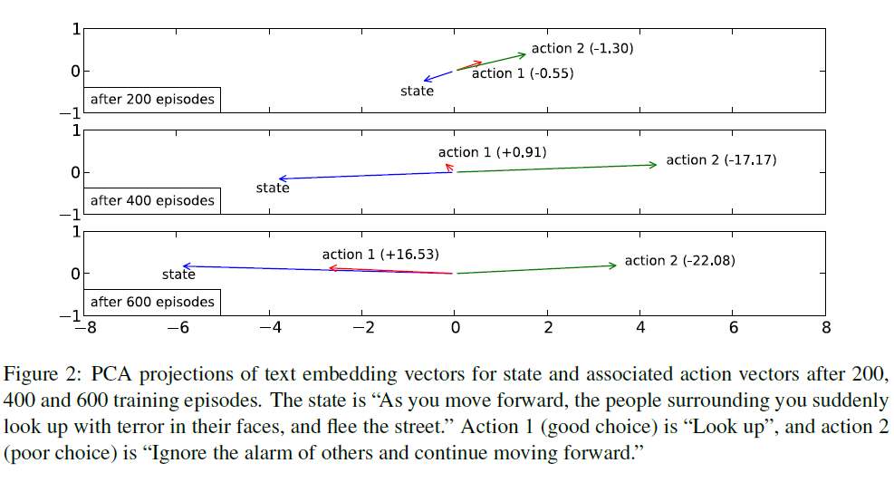
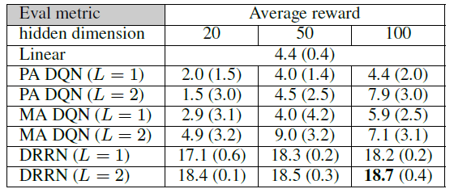
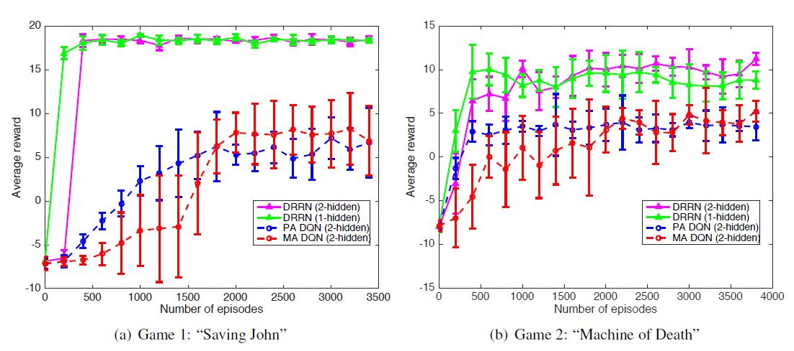

# Deep Reinforcement Learning with a Natural Language Action Space
by [He et al. (2016)](http://arxiv.org/abs/1511.04636)

## I. 초서

## 0. Abstraction
* 텍스트 게임 문제를 위한 DRRN (Deep Reinforcement Relevance Network) 모형을 제안한다.
* 강화학습의 Q-함수를 근사하기 위해 interaction 함수를 이용하는데, 이 함수는 state와 action 공간에 대한 임베딩 벡터를 따로 구성하고 이 둘을 종합하는 방식으로 만들어진다.
* 두 개의 유명 텍스트 게임에 적용하여 모형을 검증하였고, 다른 DQN 모형과 성능을 비교하였다.

## 1. Introduction
* 이 연구의 목표는 텍스트 게임과제에서 매 단계마다 상태와 행위를 표상하는 텍스트를 각각 이해하고 가장 장기적으로 게임 보상값을 최대화할 수 있게 텍스트 게임을 수행하는 것이다.
* 신경망 모형이 큰 상태공간을 표상하는데 유용하다는 사전연구(TD-gammon)와 최근 딥러닝의 발전과 함께, DQN 모형의 등장(Mnih et al., 2015)은 Narasimhan et al. (2015)이 LSTM-DQN 모형으로 텍스트 게임 문제을 풀려는데 영향을 주었다.
* 보다 최근에는 언어기반 연쇄적 의사 결정연구에 목적지향적 웹 네비게이션 과제가 제안되었다 (Nogueira and Cho (2016). 또한 크기가 큰 연속적 action space에 대한 연구와 단어와 문장에 대한 신경망 임베딩 연구의 성공은 이 연구의 배경이 되었다.
* DRRN의 핵심구조는 상태공간과 행위공간을 분리된 다른 신경망을 통해 표상을 하며, interaction 함수는 이 둘의 출력벡터의 내적과 같은 방법을 통해 **relevance** 를 결과값으로 주며 이것은 곧 현재 상태-행위 쌍에 대한 Q-함수 값으로 여겨진다.
* DRRN 연구가 다른 사전연구와 구별되는 점은 행위 공간(action space)이 이미 사전에 알려졌거나 유한하다고 보지 않고, 상태와 행위라는 두 개의 다른 유형의 텍스트에 대한 표상을 동시에 학습하려고 시도했다는 점이다.
* 이 결과, DRRN은 연속적인 행위 공간을 갖는 텍스트에 대한 더 나은 표상을 가지며, 새로운 텍스트에도 잘 적용되는 경향을 보인다.

## 2. Deep Reinforcement Relevance Network
### 2.1 Text Games and Q-learning
* 한 텍스트 게임에서는 각 단계마다 state-text와 action-text가 주어진다. 에이전트는 양쪽 측면에서 이 두 가지 텍스트를 이해하고 현재 상황의 컨텍스트 $s_t$에 대한 **적절성(relevance)** 을 계산하여야 한다.
* 물론 여기서 적절하다는 것은 장기적 보상을 최대화한다는 목적에 대해서 적절하다는 것을 의미한다.
* Q-learning 알고리즘이 사용되어, 에이전트의 controller, 즉 policy는 현재 사용 가능한(feasible) 행위들에 대한 relevance 값들을 계산하고 이에 대한 Soft-max 함수 결과값에 의해 특정 행위(action)를 선택한다.

### 2.2 Natural language action space
* 사전연구에서는 행위, *a* 에 대해 *|A|* 크기 만큼의 action-text를 제공하는 식의 접근법을 취했다 (Max-action DQN method).
* 하지만 이 전략은 매우 많은 수의 행위가 가능할 경우에는 부적합한데, 왜냐하면 DQN에서는 이런 식으로 행위공간이 큰 경우에 적합한 방법이 아니기 때문이다. 더욱이 어떤 특정 시점에서는 선택가능한 행위 옵션들이 달라질 수 있다.
* Per-action DQN 방법은 상태-행위 쌍에 대해 Q-함수를 근사시키고, 나중에 선택시 주어진 각 행위에 대한 Q-값을 구하여 행위선택에 이용하는 방식이다. 이 방법은 앞의 방법과는 다르게 시간마다 달라지는 행위집합에 대응가능하다는 장점이 있다.
* DRRN의 기본적인 접근법은 Per-action DQN과 유사하나, 상태에 대한 표상과 행위 대한 표상을 분리하여 학습하고 나중에 interaction 함수를 통해 이를 종합한다는 점에서 다르다. 텍스트 게임에서 상태공간과 행위공간의 성격은 매우 다르며, 실험에 따르면 이렇게 신경망을 양쪽 요소에 대해 분리시키는 것이 더 나은 결과를 가져온다.

### 2.3 DRRN architecture: Forward activation
* 어떤 주어진 상태-행위 텍스트 쌍, $(s_t, a^i_t)$에 대해 DRRN은 크게 두 단계의 과정을 통해 $Q(s_t, a^i_t)$를 측정한다.
* 첫 번째 단계에서는 상태와 행위 각각에 대한 신경망을 통해 각 임베딩 벡터를 계산한다.
  * 상태 벡터:$h_{l,s}=f(W_{l-1,s} h_{l-1,s} + b_{l-1, s})$
  * 행위 벡터: $h^{i}_{l,a}=f(W_{l-1,a} h^{i}_{l-1,a} + b_{l-1, a})$
  * *h* 함수는 위에서와 같이 l 번째 히든 레이어와 상태 혹은 행위에 대해서 정의되며, 함수 *f* 는 비선형 활성함수(tanh)를 가리킨다. 그리고 *i* 는 행위에 대한 인덱스이다.
* 두 번째 단계에서는 상호작용 함수를 통해 $Q(s_t, a^i_t)$를 얻는다. 이 단계에 이르면, 주어진 상태와 특정 행위 텍스트에 대한 최적의 행위를 구할 수 있게 된다.
  * Optimal action $=\operatorname{arg\,max}_{a^i_t} Q(s_t, a^i_t)$
  * $Q(s,a^i ; \Theta)=g(h_{L,s}, h^i_{L,a})$
  * 상호작용 함수 *g* 는 두 항의 (1) inner product, (2) bi-linear operation, 혹은 (3) nonlinear function 일 수 있다.

### 2.4 Learning the DRRN: Back propagation
* Mhin et al. (2015)와 마찬가지로 experience-replay (Lin, 1993)를 사용하여 replay bvffer로부터 랜덤하게 상태이행 데이터 $(s_k, a_k, r_k, s_{k+1})$를 뽑아서 예측오차를 계산하고 이를 모형학습에 이용하였다. (알고리즘 1)
* 주의할 것은 학습시에 모든 행위들은 역전파 알고리즘ㅇ르 통해 학습된 동일한 모형 파라미터를 공유한다는 것이다. 보상신호를 통해 상태와 행위는 유사한 방향의 벡터의 형태로 만들어진다. 이 과정은 그림 2에서 잘 보여진다.

* 알고리즘 1

## 3. Experimental Results
### 3.1 Text games

* 텍스트 게임에는 크게 parser-based, choice-based, hypertext-based 게임이 있다.
* Parser-based 텍스트 게임은 텍스트 커맨드를 플레이어가 입력하면 이를 파서가 해석하여 행위를 수행하는데 반해, 다른 두 종류의 게임은 제시된 선택지 중에 하나를 플레이어가 선택하는 방식으로 플레이가 진행된다.
* Narasimhan et al. (2015)의 연구처럼 parser-based 텍스트 게임에 DQN을 적용하고자 하면 정해진 수의 행위공간을 가정하게 된다는 문제가 생긴다.
* 본 연구에서는 choice-based 게임 (Saving John)과 hpyertext-based 게임 (Machine of Death)을 대상으로 실험하였다.

  | Game                    | Saving John | Machine of Death |
  |-------------------------|-------------|------------------|
  | Text game type          | Choice      |Choice & Hypertext|
  | Vocab size              | 1762        | 2258             |
  | Action vocab size       | 171         | 419              |
  | Avg. words/description  | 76.67       | 67.80            |
  | State transitions       |Deterministic| Stochastic       |
  |# of states (underlying) | >= 70       | >= 200           | 
  |Max # of feasible actions| 4           | 9                |

* 각 게임의 다른 엔딩에 대해 좋고 나쁨의 정도에 따라 최종 보상값을 임의로 부여했으며, 게임의 매 진행 단계마다 작은 음수값을 보상값으로 주었다.
* 텍스트 입력의 feature 에는 단순 bag-of-words를 사용하였다.

### 3.2 Experiment setup
* 히든 레이어 1과 2 모두에 DRRN을 적용하고, 상호작용 함수에 dot-product 조건을 메인으로 하여 실험 
* 비교 조건들
  * Linear model
  * Max-action DQNs
  * Per-action DQNs
* 실험 모수들

  | Parameter                   | Saving John |
  |-----------------------------|-------------|
  | Dimenstions of hidden layer | 20, 50, 100 |
  | Constant learning rate      | 0.001       |
  | # of mini-batch             | 200 episodes|
  | Softamx alpha (Saving John) | 0.2         |
  | Softamx alpha (Machine of Death) | 1.0    |
  | Discount factor             | 0.9         |
 
### 3.3 Performance
* The final average rewards and standard deviations on “Saving John”.
  
* The final average rewards and standard deviations on “Machine of Death”.
  
* Learning curves of the two text games
  
* 두 번째 게임의 복잡성으로 인해 최적 성능을 알 수 없기 때문에, 8 명의 인간 참가자가 기록한 초기 성적과 나중 성적은 각각 -5.5, 16.0 이었다.
* 상호작용 함수의 실험 결과, bilinear 함수가 비슷한 결과를 신경망 모형은 그보다 떨어지는 성능을 보였다.

### 3.4 Actions with paraphrased descriptions
* 게임 2 실험을 통해 얻은 모형이 새로운 데이터에 대해서도 유사하게 작동하는지를 실험하기 위해 게임 2의 action-text를 사람이 직접 유사한 의미로 다시 써서 이를 가지고 실험을 해보았다.
  
* The final average rewards and standard deviations on paraphrased game “Machine of Death”
  

## 4. Related Work
* 사전 연구에서 강화학습은 대화 관리 시스템에 응용되었던 적이 있었다.(Scheffler and Young, 2002; Young et al., 2013).
* 또한 텍스트로부터 정보 추출을 하고 텍스트로 쓰여진 명령을 행위로 옮기는 과제에 적용된 바가 있었다.(Branavan et al., 2009, 2011)
* 본 연구와 가장 직접적으로 연관된 연구는 Narasimhan et al. (2015)의 LSTM-DQN을 이용한 연구지만 이들의 방법론은 다양한 종류의 텍스트 게임에 적용하기 어렵다는 한계점을 지닌다.
* Narasimhan et al. (2015)에서와는 달리 본 연구에서는 LSTM 모형이 BOW 모형에 비해 더 나은 성능을 보이지 못했다.

## 5. Conclusion
* 텍스트 게임에 적용 가능한 새로운 DQN 아케텍처 제시
* 상태공간과 행위공간에 대해 구분된 임베딩 벡터 공간모형을 적용하여 효과를 봄
* 향후엔 보다 발전된 신경망 모형과 보다 복잡한 텍스트 게임에 적용해 볼 필요가 있다.
