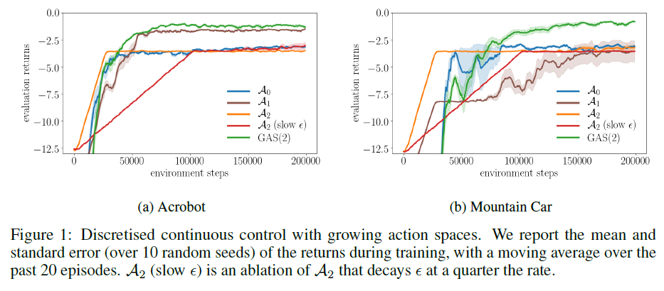
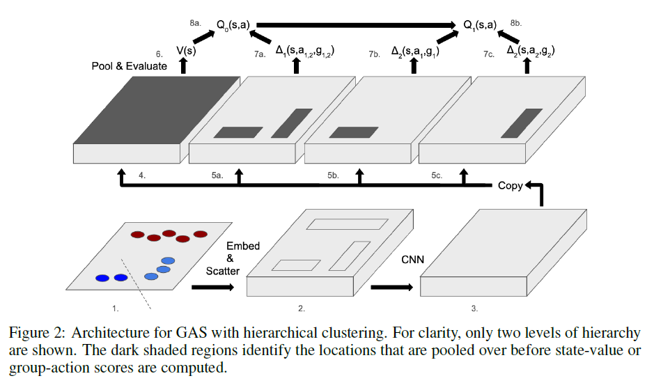
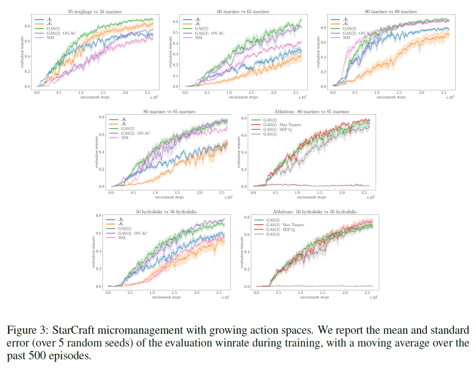

# Growing Action Spaces
by [Farquhar et al. (2019)](http://arxiv.org/abs/1906.12266)

## Basic approach
* A curriculum of progressively growing action spaces to accelerate learning
* Off-policy RL methods
* Two experiments
  * Acrobot and Mountain-car tasks
  * StarCraft micromanagement tasks

## Introduction
* 환경이 복잡할 때, 랜덤탐색으로는 행동학습은 힘들다.
* 커리큘럼 러닝 아이디어를 행위공간 선택 문제에 응용한다.
* 행위공간에 커리큘럼을 만들어 차츰 공간의 크기를 증대시키는 전략
* Each action space is a strict superset of the more restricted ones.
* 행위공간의 위계화가 필요한 전략이지만 이런 식의 위계화는 그리 어렵지 않다.
* How to learn value functions on the **off-action-space** --> learn value functions corresponding to each level of restriction simultaneously
* We can use the relationships of these value functions to each other to accelerate learning further, by using value estimates themselves as initialisations or as bootstrap targets for the less restricted action spaces, as well as sharing learned state representations.
* In this way, we transfer data, value estimates, and representations for value functions with restricted action spaces to those with less restricted actions spaces

## Related work
* An approach that uses progressive widening to consider increasing large action spaces over the course of search (Chaslot et al., 2008)
* Planning for continuous action spaces (Couëtoux et al., 2011)
* Traning mixture of two policies with an AC approach, learning a single value function for the current mixture of policies (Czarnecki et al., 2018).
* The mixture contaians a policy that may be hearder to learn but has a higher performance ceiling, such as a policy with a larger action space as we consider in this work.

> In contrast, we simultaneously learn a different value function for each policy, and
exploit the properties of the optimal value functions to induce additional structure on our models.
We further use these properties to construct a scheme for off-action-space learning which means our
approach may be used in an off-policy setting.

## Bacground
* Q-learning 을 사용하는 이유는 off-policy 학습이 off-action-space 학습에 적합하기 때문이다.
* For unrestricted action space , we define a set of N action spaces .
* Each action space is a subset of the next: .
* The optimal policy is  and its corresponding value and action-value functions are  and .

## Curriculum learning with growing action spaces
### Off-action-space learning
* A value function for an action space  may be updated with transitions using actions drawn from its own action space, or any more restricted action spaces.
* The restricted transitions simply form a subset of the data required to learn the value functions of the less restricted action spaces.
* To exploit this, we simultaneously learn an estimated optimal value function  for each action space .

## Value estimates
* Equation 2

.

* Equation 3: leveraging hierachical structure

* Equation 4: modified Bellman optimality equation

* We expect that policies with low  are easier to learn, and that therefore the corresponding  is more accurate earlier in training.

## Representation
* By sharing parameters between the function approximators of each , we can learn a joint state representation.
* PBT 대신 단순한 linear scheduling을 활용했다.

## Growing action spaces for multi-agent control
* 협동적 멀티 에이전트 세팅에서 본 연구의 전략은 행위공간이 감당이 안 되게 커지는 문제가 발생한다.
* 이 문제를 보완하고자 위계적 군집화 알고리즘을 도입해서 가까운 위치에 있는 에이전트는 같은 행위 그룹으로 묶는다(k-means clustering).

> At the first level of the hierarchy, we treat the whole team as a single group, and all agents are
constrained to take the same action. At the next level of the hierarchy, we split the agents into k
groups using an unsupervised clustering algorithm, allowing each group to act independently. At
each further level, every group is split once again into k smaller groups

* A potential problem is that the clustering changes for every state, which may interfere with generalisation across state-action pairs as group-actions will not have consistent semantics.
  * We include the clustering as part of the state, and the cluster centroids are re-initialised from the previous timestep for t > 0 to keep the cluster semantics approximately consistent.
  * We use a functional representation that produces group-action values that are broadly agnostic to the identifier of the group.

## Experiment results
### Discretised continuous control

### Combinatorial action spaces: StarCraft battles
* Micromanagement, the low-level control of units engaged in a battle between two armies
* In our experiments we focus on much larger-scale micromanagement scenarios with 50-100 units on each side of the battle.
* The action space for each unit permits an **attack-move** or **move** action in eight cardinal directions, as well as a **stop** action that causes the unit to passively hold its position.
* In our experiments, we use k = 2 for k-means clustering and split down to at most four or eight groups.
* Our base algorithm uses the objective of n-step Q-learning and collects data from multiple workers into a short queue

### Model architecture

* In our default approach, each group’s action-value is given by the sum of the state-value and group-action-scores for the group and its parents.
* In ‘SEP-Q’, each group’s action-value is simply given by the state-value added to the group-action score (ablation condition).

### Results

* The policies learned by GAS exhibit good tactics.
* This ablation performs slightly, or considerably, worse in each scenario.
* The choice of target is less important: performing a max over coarser action spaces to construct the target as described in Section 4.2 does not improve learning speed as intended.
* Higher  slightly degraded the asymptotic performance.

>One potential reason is that it decreases the average group size, pushing
against the limits of the spatial resolution that may be captured by our CNN architecture. Higher *l*
also considerably increase the amount of time that there are fewer units than groups, leaving certain
groups empty. This renders our masked pooling operation degenerate, and may hurt the optimisation
process.

## Conclusion
* We presented an algorithm for growing action spaces with off-policy reinforcement learning to efficiently shape exploration.
* We also present a strategy for using this approach in cooperative multi-agent control.
* We demonstrate empirically the effectiveness of our approach and the value of off-action-space learning.
* An interesting future work is to automatically identify how to restrict action spaces for efficient exploration.
