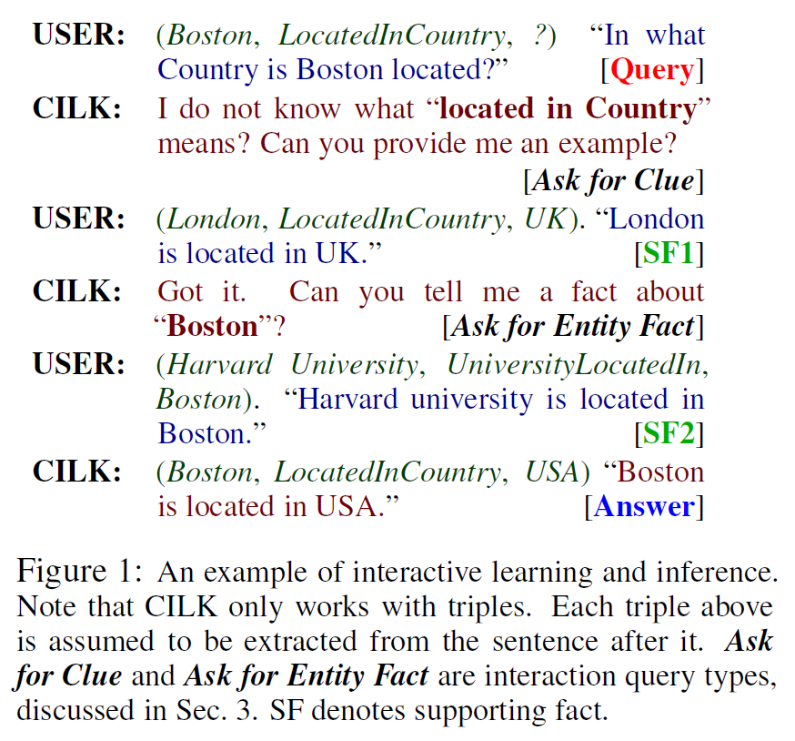

# Lifelong and Interactive Learning of Factual Knowledge in Dialogues
by [Mazumder et al. (2019)](http://arxiv.org/abs/1907.13295)

## 0. Abstract
* 기존 지식 베이스를 이용한 대화시스템 연구들은 지식 베이스에 없는 종류의 질의에 대해 대처하기가 불가능했다.
* 본 연구는 대화시스템이 연속적으로 학습하고 대화 도중에 새로운 지식을 추론하게 하는 엔진에 대해 연구한다.
* 이 엔진을 **Continuous and Interactive Learning of Knowledge (CILK)** 이라고 명명한다.

## 1. Introduction
* 대화시스템이 lifelong learning 을 하게 한다는 아이디어가 인기를 끌고 있다.
* 이런 시스템은 (1) 가용한 자원으로부터 지식을 추출하는 능력과 (2) 대화 중간에 상대방으로부터 학습을 이끌어 내는 능력을 갖는다.
* 본 연구는 (2)번 능력에 초점을 맞추어 사용자의 wh-question에 대해 시스템이 답변할 수 없을 때 새로운 지식을 사용자로부터 배우는 엔진을 연구했다.
* CILK가 다루는 지식의 요소들은 모두  로 이루어진다.
  * "Boston is located in USA"  "(Boston, LocatedInCountry, USA)"
* 본 연구는 시스템의 핵심 엔진에 대해서만 관심을 두며 응답 생성과 같은 문제는 논외로 둔다.
* OpenIE 모듈을 이용해 텍스트로부터 (h, r, t) 트리플을 추출하는 상황을 가정하였다.

### Problem Definition
> Given a user query / question (h, r, ?) [or (?, r, t)], where r and h (or t) may not be in the KB (i.e., unknown), our goal is two-fold

* Answering the user query or rejecting the query to remain unanswered
* Learning / acquiring some knowledge (facts) from the user to help the answering task.

본 연구에서는 사용자 질의를 두 가지로 구분한다.
* **Closed-world queries**, where h (or t) and r are known to the KB
* **Open-world queries**, where either one or both h (or t) and r are unknown to the KB

Open-world queries 에 대해 본 연구의 접근법은 두 단계로 이루어진다.
1. 단계 1: 사용자와 상호작용을 한다.
  * 사용자에 대한 질의를 통해 열린세계 질의문을 닫힌세계 질의문으로 변환한다.
  * 사용자는 그 과정에서 시스템에게 **supporting facts (SFs)** 를 제공하고, 이는 시스템의 새로운 지식으로 편입된다.
  * 이 단계를 *interactive knowledge learning* 로 부를 수도 있다.
2. 단계 2: 질의문에 대한 답변을 추론한다.
  * The main idea is to use each entity e in the KB to form a candidate triple (h, r, e) (or (e, r, t)), which is then scored.
  * 가장 높은 점수를 받은 후보가 답변으로 채택된다.
  * 이 문제는 곧 **knowledge base completion (KBC)** 문제로 볼 수 있으나 CILK는 여기서 닫힌세계 가정을 취하지 않다는 점에서 차이를 보인다.

  

## 2. Related Work
* Previous research in (Mazumder et al., 2018)
* Language grounding research (Wang et al., 2016, 2017)
* Learning on the job (Chen and Liu, 2018)
* KB completion (KBC) research (Lao et al., 2011; Bordes et al., 2011, 2015; Mazumder and Liu, 2017)
* None of the KBC methods perform conversational knowledge learning like CILK.

## 3. Proposed Technique
* CILK의 세 구성요소
  * Knowledge Base (K)
  * Interaction Module (I): SFs 획득 여부를 결정
  * Inference Module (M): 추론과정을 담당

### 3.1 Problem Formulation
* Query q 는 (e, r, ?) 혹은 (?, r, e) 로 정의됨
  * Open-world query:  and/or 
  * 위의 조건에 해당되지 않으면 q 는 closed-world query 가 된다.
* 사용자가 던진 열린세계 쿼리에 대해 CILK는 supporting facts를 획득하기 위해 사용자와 상호작용한다.
  * Clue triples: 
  * Entity fact triples: 
* 단계 1에서 시스템은 복수의 턴을 통해 사용자에게 supporting facts를 얻을 것인지를 결정한다.
* Supporting facts가 모아지면 시스템은 쿼리 q 를 추론하기 위해  을 이용한다.

### 3.2 Inference Model
* Neural Knowledge Base Embedding (KBE) 방법이 추론모형에 적용되었다.
* KBE 방법은 KB의 triple들을 임베딩 방법을 통해 벡터공간으로 표상시킨다.
* 평가함수 S(h, r, t)는 주어진 triple이 타당한지 아닌지에 대한 정보를 제공하는 역할을 한다.
* Relation embedded vectors: 
* DistMult (Yang et al., 2014)가 KBE 모형을 평가하기 위해 사용되었다.

* 는 KB에 존재하는 triple 집합을 가리키고 는 negative sampling에 의한 triple 집합을 가리킨다.
#### Rejection in KB Inference
* 주어진 쿼리를 거절할 것인지 아닌지를 결정하기 위해 threshold buffer 에 entity 혹은 relation 에 대한 역치 예측값을 저장하고 계속 업데이트한다.

* 위 수식에 따라 주어진 쿼리에 대해 다음과 같은 역치 예측값을 구한다. 
#### Inference Decision Making
* 만일 추론모형에 의해 주어진 예상답변이 실제 존재하고 평가함수 S(q, e)가 역치 예측값보다 높다면 예상답변을 사용자에게 제공한다.

### 3.3 Working of CILK
* 시스템의 상호작용 과정이 불필요하게 작동하는 것을 제한하기 위해 **performance buffer**  에 과거 대화 기록에서의 CILK 성능지표를 저정한다.
* 본 연구에서는 Mean Reciprocal Rank (MRR)을 추론모형의 성능을 측정하기 위해 사용하였다.
* 과 은 추론모형에 의한 MRR 평균을 자리킨다.
* 각 대화 세션 끝에는 performace buffer에서 MRR 점수가 낮은 쿼리 relation과 entity들을 골라 **diffident set** 을 구성한다.

## 4. Experiments
### 4.1 Evaluation Setup
* 실험을 위해 **simulated user** 가 구축되었음
* 시스템 성능을 측정하기 위해 streaming query dataset을 이용하였다.
* 본격적인 학습에 앞서 initial training phase 가 주어진다.
  * CILK는 initial knowledge base가 주어진다고 가정되었다.
  * 그리고 추론모형은 이 초기 KB에 대해 주어진 회차만큼 학습을 하게 된다.
  * 이 초기학습 과정을 통해 초기 performance buffer 및 threshold buffer 를 획득하게 된다.
* Datasets for simualted user and tests

#### Compared Models
* 비교 가능한 사전 연구가 없기 때문에 CILK의 여러 버전들이 비교모형으로 이용되었다.
* CILK variants based on prediction threshold types
  * EntTh-BTr: 
  * RelTh-BTr: 
  * MinTh-BTr: 
  * MaxTh-BTr: 
* CILK variants based on dataset sampling strategies
  * MaxTh-EntTr: only samples triples involving e
  * MaxTh-RelTr: samples only triples involving r
* Evaluation 척도로 mean reciprocal rank 와 Hits@k 를 사용하였다.

### 4.2 Results and Analysis

* MaxTh-BTr 조건이 가장 좋은 성능을 기록하였다.
* 다양한 역치 실험 조건 중에서는 MaxTh-BTr 과 MinTh-BTr 이 더 나은 성능을 보였다.
* RelTh-BTr 조건이 상대적으로 낮은 성능을 보여준 것은 역치라는 요소가 성능향상에 크게 기여했다는 것을 뜻한다.
* 다양한 데이터셋 샘플링 조건에 대한 결과를 볼 때, MaxTh-BTr 이 더 나은 성능을 보였다.

## 5. Future Research and Conclusion
* 본 연구에서 제안한 시스템은 사용자의 wh-question에 대해 KB를 이용할 수 없을 때, 사용자와 상호작용을 통해 새로운 사실을 KB에 추가하고 정답을 추론하여 주어진 문제를 해결하는 방법을 제시하였다.
* 본 연구는 사용자가 틀린 지식을 주입하는 경우 및 사실 추출과정에서 발생하는 오류와 같은 문제들을 다루지는 않았다. 그것들은 다른 독립적인 문제이다.
* 본 연구의 시스템은 또한 새로운 개념이나 대화 주제, 사용자의 특성 등을 학습하지는 못한다는 한계를 갖는다.
* 향후에 CILK의 모든 구성요소가 함께 스스로 학습되는 end-to-end 시스템을 연구할 것이다.
* 또한 KB에 새로운 relation이 추가되었을 때 거기에 대한 학습 데이터가 부족하면 발생하는 cold start 문제 연구
