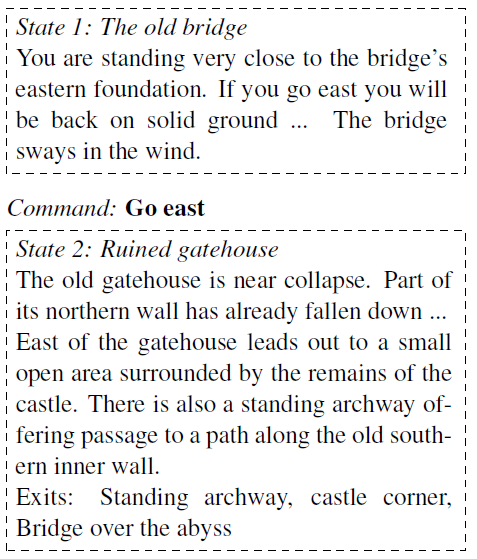
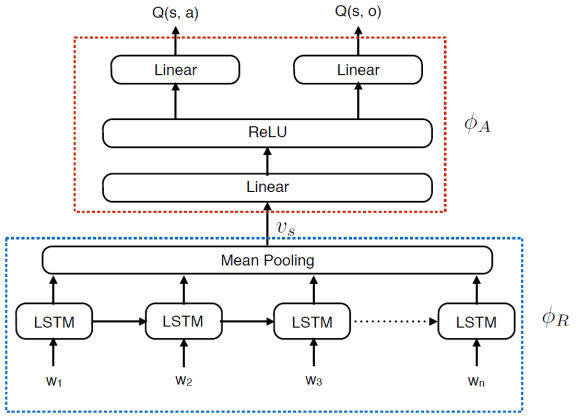
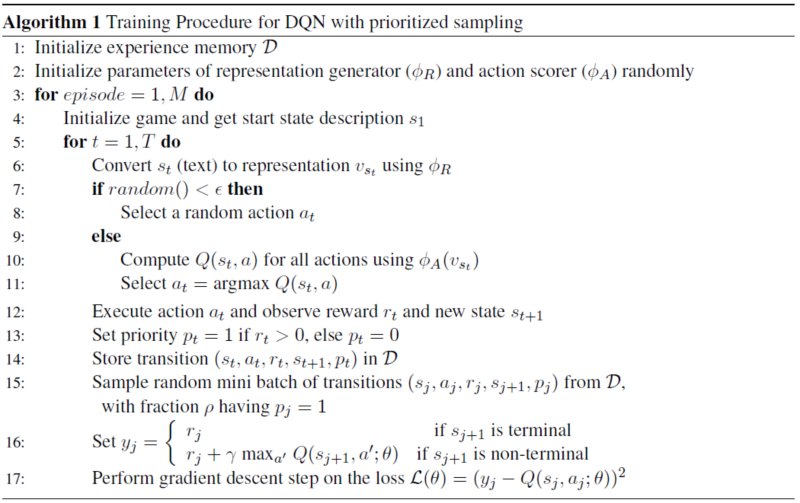
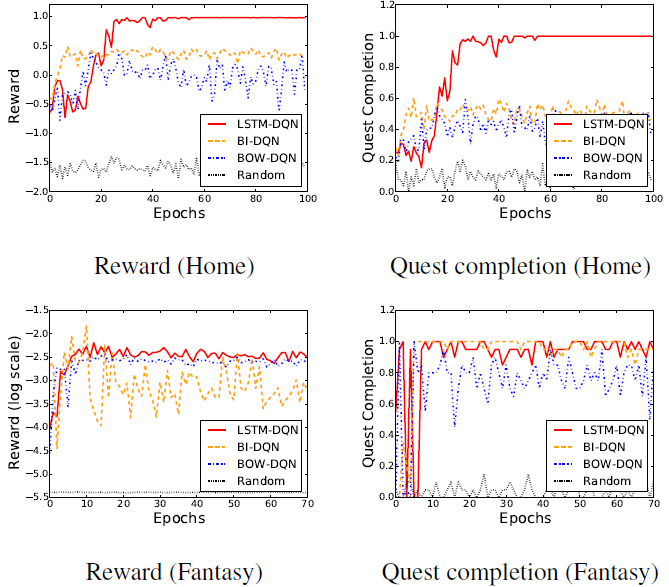
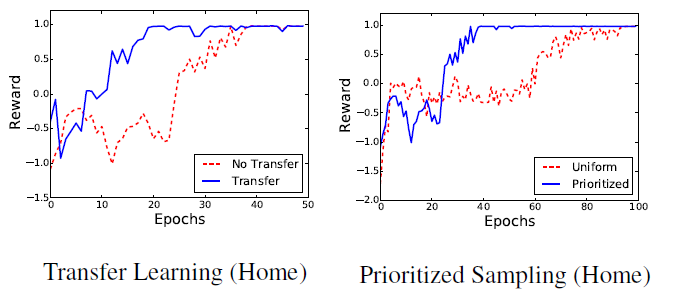
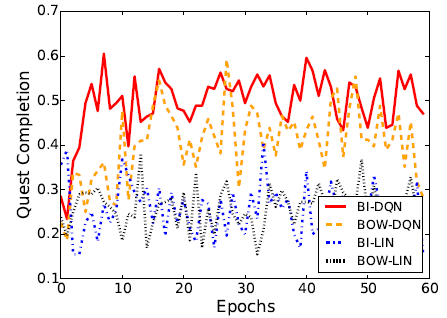
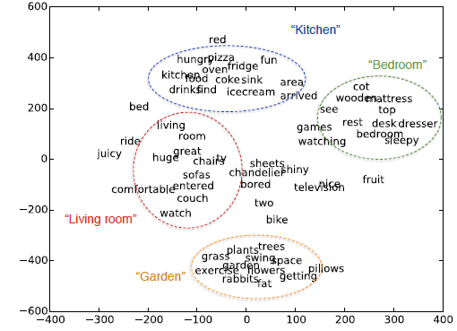

# Language Understanding for Text-based Games using Deep Reinforcement Learning
by [Narasimhan et al. (2015)](https://arxiv.org/abs/1506.08941)

## I. 초서
## 0. Abstraction
* 텍스트 기반 게임의 control policy 학습과제에 강화학습 알고리즘인 DQN을 적용하고자 한 연구이다.
* 텍스트 기반 게임에서 모든 상호작용은 텍스트를 통해 이루어지며, 환경에 대한 관찰은 완전하지 않으며 부분적(partial)이다.
* 상태표상 방법으로 신경망 모형을 쓰는 DQN 방법과 bag-of-words 방법과 bag-of-bigrams 방법을 비교하였다.

## 1. Introduction
* 텍스트 기반 게임은 과거에 그래픽 기반 게임들이 번성하기 전에 나와 지금까지도 플레이되고 있다. 텍스트 게임을 플레이하기 위해서는 텍스트로 제공되는 게임상황을 읽고 이해하며, 텍스트 명렁어를 통해 게임액션을 수행할 수 있어야 한다. 이 과정은 기존의 AI 프로그램들에게 쉬운과제가 아니다.
* 우선 게임상황에 대한 텍스트 기술을 어떻게 표상할 것인가의 문제가 있는데, 여기에 대한 한 가지 흔한 대응은 bag-of-words 모형을 이용하는 방법과 사전에 정의된 구조로의 변환을 통한 방법이 있다.
* 이 연구에서는 게임액션을 통제하는 policy와 함께 게임상황 텍스트 표상을 학습하게 하기 위해 강화학습 알고리즘을 도입한다. 강화학습 프레임워크에 따라 게임 에이전트는 장기적 보상 기대값을 최대화하기 위해 주어진 환경의 각 상황에서 행위-상태 가치함수, $Q(s,a)$를 최대화하는 전략 혹은 정책인 policy를 학습하게 된다.
* 본 연구에서는 심층 강화학습 방법인 Mnih et al. (2015)의 DQN 방법을 사용하는데, 이 DQN은 두 가지 주요 구성요소로 이루어진다. 첫번째 요소는 텍스트로 표현되는 상태를 기술하기 위한 LSTM 네트워크이며, 두번째 요소는 벡터형태로 주어지는 상태정보에 따라 게임액션을 선택하는 행위선택 레이어이다.
* 학습모형 검증을 위해 Multi-User Dungeon (MUD)의 두 가지 게임을 이용하였는데, 첫번째 게임은 이 과제 전반을 위한 통제 조건을 위한 것이며 두번째 게임은 다양한 언어적 변인을 가지는 공개된 게임이다.
* 실험결과, 이 연구에서 제안하는 LSTM-DQN 모형은 BOW 모형과 BOBigrams 모형에 비해 뚜렷하게 더 높은 게임 완료율을 보였으며, 이 과정에서 학습된 표상체계는 다른 게임들에서도 재사용이 가능하다는 것과 행위-상태 함수 값(Q-values)의 보다 빠른 학습과 수렴을 돕는다는 것을 보여주었다.

## 2. Related Work
* 게임이란 매체는 grounded 언어 분석에 풍부한 영역을 제공한다. 하지만 사전연구들은 대체로 완전히 관찰가능한 게임환경을 대상으로 하였다.
* Gornial & Roy (2005)와 Eisenstein et al. (2009)의 연구가 자연어 텍스트 기반 게임 플레이의 문제를 다루었으나 본 연구처럼, 텍스트 해석과 게임전략 학습의 문제를 통합적인 프레임워크를 통해 처리하려는 목적과는 상당한 거리가 있었다.
* 비디오 게임이라는 점에서 본 연구의 도전과제와는 상이하지만 게임 컨트롤 학습을 위해 강화학습 프레임워크를 사용했다는 점에서 Mnih (2015)는 본 연구와 밀접한 관계가 있다. 다만 본 연구의 텍스트 게임은 비디오 게임과는 달리 게임상황이 텍스트를 통해 제공되므로 에이전트의 게임상황 인식이 직접적이지 않고, 텍스트는 시퀀스 데이터이므로 CNN이 아니라 RNN 계열 신경망 모형인 LSTM을 사용하였다는 차이점이 있다.

## 3. Background
### Game representation
* 게임은 여기서 $<H, A, T, R, \Psi>$로 표상되며, 각 구성요소의 의미는 다음과 같다.
* $H$: 모든 가능한 게임상태들의 집합
* $A={(a,o)}$: 모든 가능한 명령문 (행위와 행위 대상의 쌍)의 집합
* $T(h'|h,a,o)$: 상태간 이행 함수
* $R(h,a,o)\in \mathbb{R}$: 보상값 함수
* 게임상태, *H* 는 에이전트에게 숨겨져(hidden) 있으며, 함수 $\Psi : H\rightarrow S$에 의해서 그 정보가 알려진다.
* 현재 게임상황을 기술하는 텍스트의 상태는 $s \in S$로 표현된다.
### Q-Learning
Q-Learning (Watkins and Dayan, 1992)은 모델-자유(model-free) 방법으로 에이전트의 최적 가치함수 *Q(s,a)* 를 학습하는데 널리 사용된다. 이 함수는 처음에는 랜덤하게 행위를 선택하다가 게임을 수행하면서 주어지는 보상값에 따라 *Q* 함수를 순차적으로 조정해나가는데, 그 갱신과정에는 벨만 등식이 이용된다.(Sutton and Barto, 1998)
$$Q_{i+1}(s,a)=\mathbb{E}[r+\gamma \max_{a'} Q_i(s',a')|s,a]$$

### Deep Q-Network
* 본 연구과제의 상태공간의 크기가 너무 크므로 *Q(s, a)* 는 $Q(s,a,\theta)$를 통해 근사되도록 하는 방법을 써야 하고, 그 함수는 DQN 모형을 따라 인공신경망을 쓰기로 한다.
* 상태표상에 쓰이는 신경망 모형은 단순한 선형변환을 통한 근사법보다 더 복잡한 상태를 표상할 수 있도록 도와준다.

## 4. Learning Representations and Control Policies
* LSTM-DQN은 크게 두 부분으로 이루어지느데 첫번째 부분은 게임상태를 표상하는 LSTM 신경망 (representation generator), 두번째 부분은 게임액션을 선택하는 출력층 (action scorer)이다.(아래 그림)

### Representation Generator ($\phi_R$)
* 게임의 텍스트 기술에 대해 Bag-of-Words 모델보다 더 풍부한 상태표상을 얻기 위해 LSTM 신경망 모형을 이용하였으며, 문장의 각 입력단어들은 임베딩을 거쳐 LSTM 레이어의 입력값으로 들어오게 된다.
* K개 단어로 이루어진 문장의 단어들이 LSTM 레이어를 거쳐 각각 출력 벡터 $x_k$로 나오게 되면, **mean pooling layer** 를 거쳐 상태표상을 위한 벡터 $v_s$를 내놓는데 이 과정은 아래의 공식과 같이 평균벡터를 구하는 것이다.

$$v_s=\frac{1}{n} \sum_{k=1}^{n} x_k$$

### Action Scorer ($\phi_A$)
* 이 모듈은 주어진 게임상태 정보에 대해 선택가능한 모든 행위에 대한 평가치를 제공한다.
* 상태표상 벡터 $v_s=\phi_R (s)$이 주어졌을 때, 모든 선택 가능한 행동 $a \in A$에 대한 행위-상태 함수값을 다음과 같이 $Q(s,a)\approx \phi_A(v_s)[a]$ 제공한다.
* 텍스트 커맨드 선택 문제를 단순하게 하기 위해, 오직 한 개의 행위 명령어와 한 개의 목적어가 주어진 경우("eat apple")만을 고려하였으며, 이는 대다수의 게임액션들을 커버한다.
* 최종 *Q* 함수값은 *Q(s, a)* 와 *Q(s, o)* 값의 평균으로 계산하였다.

### Parameter Learning
* $\theta_R$과 $\theta_A$에 대한 모델 파라미터는 RMSprop을 이용한 SGD에 의해 학습되었다.
* 학습을 위한 경험 데이터는 메모리 버퍼 역할을 하는 배치 데이터셋, $\mathcal{D}$의 데이터를 sampling 하여 사용하였다.
* 비용함수에는 현재 상태에 대한 *Q* 함수의 값과 다음 상태에 대한 *Q* 함수의 argmax 값(TD-target)과의 차이가 이용된다.
$$y_i=\mathbb{E}_{\hat{s},\hat{a}}[r+\gamma \max_{a'}Q(s',a';\theta_{i-1})|\hat{s},\hat{a}]$$
$$\mathcal{L}_i (\theta_i) = \mathbb{E}_{\hat{s},\hat{a}}[(y_i - Q(\hat{s},\hat{a};\theta_i))^2]$$

* 파라미터 $\theta$에 대한 학습은 $\mathcal{L}_i (\theta_i)$에 대해 다음과 같은 식이 이용된다.
$$\nabla_{\theta_i} \mathcal{L}_i (\theta_i) = \mathbb{E}_{\hat{s},\hat{a}}[2(y_i - Q(\hat{s},\hat{a};\theta_i)) \nabla_{\theta_i}Q(\hat{s},\hat{a};\theta_i)]$$

### Mini-batch Sampling
* 미니배치를 통한 파라미터 학습은 신경망 학습에는 널리 쓰이는 경제적이며 효율적인 방식이다.
* 미니배치를 구성하는 가장 단순한 방식은 경험 버퍼로부터 uniform 랜덤 샘플링을 하는 방식이다.
* 하지만 강화학습에서는 오차의 크기에 따라 각 샘플에 우선순위(priority)를 부여해서 이를 샘플링에 이용하는 방법(prioritized sampling)도 있다. (Moore and Atkeson, 1993)

### **Algorithm 1** Training Procedure for DQN with prioritized sampling

## 5. Experimental Setup
### Game Environment
* 실험에 필요한 게임환경을 만들기 위해 오픈소스 게임엔진 Evennia를 이용하여 *Home world* 환경을 제작하였으며, 기존에 제작된 *Fantasy world* 환경도 실험에 활용하였다.
* Table 1: Various statistics of the two game worlds

| Stats                               | Home World    |Fantasy World|
| ----------------------------------- |:-------------:|:-----------:|
| Vocabulary size                     | 84            | 1340        |
| Avg. words / description            | 10.5          | 65.21       |
| Max descriptions / room             | 3             | 100         |
| # diff. quest descriptions          | 12            | -           |
| State transitions                   | Deterministic | Stochastic  |
| # states (underlying)               | 16            | >=56        |
| Branching factor (# commands/state) | 40            | 222         |

* *Home world* 는 상대적으로 작은 환경이지만 게임 환경이나 목적에 대한 기술은 부정어를 포함한 자연어로 이루어지므로 에이전트는 자연어 이해 능력이 어느정도 요구된다.
* 이 게임환경은 퀘스트를 성공적으로 완료할 경우에는 긍정적인 보상값을, 실패하면 부정적인 보상값을 주며, 또한 퀘스트 종료 전에는 작은 부정적 보상값을 지속적으로 부여한다.
### Evaluation
* 게임 에이전트의 성능을 측정하는 지표로 (1) 게임 에피소드별 평균 누적 보상값과, (2) 게임 퀘스트 완료비율을 보았다.
* *Home world* 에 대한 성능 검증을 위해선 20회 step의 에피소드 50개를 학습과 시험시에 각각 사용하였다.
* *Fantasy world* 에 대해서는 20회 step의 에피소드 250개를 학습과 시험시에 각각 사용하였다.
* 시험시 탐험적 행위 비율을 의미하는 엡실론 값은 0.05를 유지하였다.
### Baselines
* LSTM-DQN
* Random-agent
* BOW-DQN
* BI-DQN
### Settings
| Parameters                            | Value                             |
|---------------------------------------|-----------------------------------|
| Memory buffer size                    | 100,000                           |
| Discount rate (Gamma)                 | 0.5                               |
| Learning rate for RMSprop             | 0.0005                            |
| Epsilon (training)                    | 1 to 0.2 over 100,000 transitions |
| Period for mini-batch gradient update | 4 steps of the gameplay           |
| Roll out size of LSTM (Home world)    | 30                                |
| Roll out size of LSTM (Fantasy world) | 100                               |
| Rho for prioritized sampling          | 0.25                              |
| Mini-batch size                       | 64                                |
| Word embedding size                   | 20                                |

## 6. Results
### 6.1. Results of DQN and Baselines

### 6.2. Results of Transfer Learning and Prioritized Sampling

### 6.3. Quest completion rates of DQN vs. Linear models on Home world

### 6.4. t-SNE visualization of the word embeddings after traning on Home world

## 7. Conclusion
* 심층 강화학습 프레임워크를 아래 게임중 주어지는 보상값을 이용하여 상태표상과 행위선택 정책을 동시에 학습할 수 있다는 점을 보였다.
* LSTM-DQN의 신경망은 게임 상태를 기술하는 자연어 텍스트를 적절한 의미의 벡터 표상으로 사상할 수 있음을 보여주었다.
* 실험을 통해 텍스트에 대한 좋은 표상방법이 게임의 수행을 위해서는 매우 중요하다는 점이 증명되었다.
