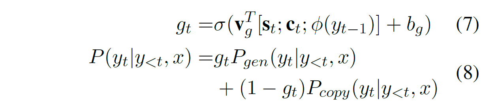

# Semantic Parsing with Dual Learning
by [Cao et al (2019)](https://www.aclweb.org/anthology/P19-1007)

## 0. Abstract
* 이중학습(dual learning) 알고리즘을 이용한 시맨틱 파싱 방법 연구
* 이중학습 알고리즘은 시맨틱 파싱의 '부족한 데이터' 문제를 보완해준다.
* 주석된 데이터와 주석되지 않은 데이터 모두를 가지고 이중학습 게임을 구성한다.
  * Primal model: 시맨틱 파싱 모형
  * Dual model: 역 시맨틱 파싱 모형
  * 학습 과정에서 위 두 모형이 서로 피드백을 주고 받으며 모형을 개선해 나간다.
  * 이 과정에서 강화학습 알고리즘이 이용된다.
* 이 접근법을 통해 ATIS 데이터에 대해 SOTA를 기록했으며 OVERNIGHT 데이터에 대해서 기존 SOTA와 비슷한 결과를 얻었다.

## 1. Introduction
* 시맨틱 파싱이란 자연어 쿼리를 논리형식으로 번역하는 작업을 가리키는데, 근래에서는 Encoder-Decoder with attention 모형이 널리 응용되는 추세이다.
* 이 문제에서 주로 논의되는 두 가지 이슈
  * 적은 주석된 데이터
  * Constrained decoding
* Constrained decoding 이 필요한 근본원인은 논리쿼리는 자연어 쿼리의 모호한 구조와는 달리 명시적 구조를 갖고 있기 때문이다.

  > “show flight from ci0 to ci1” $\rightarrow$ (lambda \$0 e ( and ( from \$0 ci0 ) ( to \$0 ci1 ) ( flight \$0 ) ) )

* 시맨틱 파싱은 자연어 쿼리의 변환과정에서 통사적, 의미적 적형성 모두를 만족시켜야 한다.
* 본 연구에서는 이 문제에 이중학습 방법을 적용하는데 이것은 data augmentation 의 한 일환이다.
* 강화학습 프레임워크 안에서 이중학습의 두 에이전트는 primal model 과 dual model 이 되며 이들은 서로 보상신호를 주고 받으며 자신의 모형을 최적화 시킨다.
* 본 연구의 이점 혹은 기여들
  * 혼합형 데이터(주석된 데이터와 비주석된 데이터의)를 최대환 활용하는 시맨틱 파싱 방법 제시
  * 강화학습 프레임워크 안에서 validity reward 와 같은 만들어진 보상신호를 통해 도메인 지식을 활용하는 방법을 제시
  * 실험연구를 통해 효과성 입증

## 2. Primal and Dual Tasks of Semantic Parsing

* Primal, dual 모형은 모두 attention-based Encoder-Decoder 구조로 설계되었다.
* 또한 unknown 단어 처리를 위해 Copy 방법(Gulcehre et al., 2016; See et al., 2017) 응용되었다.

### 2.1 Primal Task
* 시맨틱 파싱 과정(Q2LF)으로 자연어 쿼리를 논리적 쿼리로 번역한다.
* 자연어 쿼리는 $x=x_1, x_2, ..., x_{|x|}$ 로 표시하고 논리적 쿼리는 $y=y_1, y_2, ..., y_{|y|}$ 로 표시한다.
* 쿼리의 단어 $x$는 단어 임베딩 함수 $\psi(x)$를 통해 일정 크기의 벡터로 변환되고 아래와 같이 인코더 bi-LSTM 모형의 입력으로 들어간다.

* 디코더는 attention 메커니즘을 갖춘 uni-LSTM 모형으로 t-th time step의 히든 벡터는 $s_t=f_{\text{LSTM}}(\phi(y_{t-1}),s_{t-1})$를 통해 획득된다. 참고로 $\phi(\cdot)$은 논리적 쿼리를 위한 임베딩 함수를 가리킨다.

* 인코더의 i 번째 단계와 디코더의 현재 시점 t 에 대한 attention weight는 다음과 같이 정의된다.
  $$
  a_i^t=\frac{\exp(u_i^t)}{\sum_{j=1}^{|x|}\exp(u_j^t)}
  $$

  $$
  u_i^t=\mathbf{v}^T\tanh(\mathbf{W}_1\mathbf{h}_i+\mathbf{W}_2\mathbf{s}_t)+\mathbf{b}_a \quad\quad (4)
  $$

  

* 이와 같은 과정을 거쳐 어휘의 확률분포 $P_{gen}(y_t|y_{<t},x)$ 는 다음과 같이 결정된다.

* Copy mechanism은 unknown 단어들을 처리하기 위한 것으로 아래와 같은 과정을 거친다.

* 위 수식에서 *KB* 는 주어진 명사를 논리식으로 맵핑시키는 dictionary 함수이다.

### 2.2 Dual Model
* Dual task는 여기서 primal task의 역함수 기능을 수행한다.
* 따라서 주어진 논리 형식으로 자연어 쿼리를 생성하는 작업을 한다.
* 여기서도 유사하게 attention 기반 Encoder-Decoder 모형을 이용한다.
* 다만 하나의 entity에 대한 자연어 표현은 다양할 수 있기 때문에 그런 경우에 $KB^{-1}(y_t)$는 랜덤으로 하나를 선택하게 했다.

## 3. Dual learning for Semantic Parsing
* 두 개의 루프
  * Q2LF: query&#8594;logical_form&#8594;query
  * LF2Q: logical_form&#8594;query&#8594;logical_form

### 3.1 Learning algorithm
* 주석된 데이터: $\mathcal{T}=\{\langle x, y\rangle\}$
* 비주석된 데이터: $\mathcal{Q}, \mathcal{LF}$
* 주석된 데이터를 가지고 MLE 방법으로 사전학습된 primal 모형과 dual 모형을 얻는다.
* 사전학습된 두 모형의 파라미터를 각각 $\Theta_{Q2LF}$ 와 $\Theta_{LF2Q}$ 로 표시한다.
* Q2LF는 입력 쿼리를 $\mathcal{Q} \cup \mathcal{T}$ 에서 샘플링하고 k-개 크기의 LF들을 생성한다.
* 각 LF에 대해 validity reward를 얻고, 이것을 다시 LF2Q에 보내 reconstruction reward를 받는다.
* 여기서 초모수 $\alpha,\beta \in [0, 1]$가 사용되어 이 두 종류의 보상값의 적절한 균형점 역할을 한다.
$$r_i = \alpha R^{val}(y_i)+(1-\alpha)R^{rec}(x,y_i)$$

* 최종적으로 강화학습의 policy gradient 알고리즘은 $\Theta_{Q2LF}$ 와 $\Theta_{LF2Q}$ 를 Q2LF와 LF2Q 모형에 대해 업데이트한다.

* 학습과정을 안정적으로 만들기 위해 $\mathcal{T}$ 로부터 주기적으로 샘플링을 하고 MLE 방법을 이용해 primal 모형과 dual 모형에 대해 fine-tuning을 했다.

## 4. Experiment
### 4.1 Dataset
* ATIS: preprocessed version provided by Dong and Lapata (2018)
* OVERNIGHT: natural language paraphrases paired with logical forms across eight domains.
* 위 두 데이터셋에는 비주석된 데이터가 없기 때문에 학습 데이터 일부를 취해서 각 데이터 쌍을 누락시킴으로써 비주석된 데이터셋을 만들었다.

### 4.2 Synthesis of logical forms
* 또한 ATIS 데이터셋의 논리쿼리에 대치와 같은 조작을 가해 4592개의 새로운 논리형식을 만들어 비주석 데이터로 사용했다. 이 논리쿼리의 변형은 온톨로지를 통해 이루어졌기 때문에 스트링 형태는 달라도 의미적으로 적형성이 유지된다.
* OVERNIGHT 데이터에 대해 문법 기반 생성모형을 이용해 500개의 새로운 적형 논리형식을 생성해서 사용했다.

### 4.3 Experiment setting
* 200 hidden units and 100-dimensional word vectors for Q2LF and LF2Q models
* LSTM 모형들은 전부 single layer 이용
* 단어 임베딩은 Glove6B에 의해 초기화
* 사용된 languae model도 single-layer LSTM 이용

### 4.4 Results and analysis
### 4.4.1 Main results
* ATT and ATTPTR: primal/dual models with attention-based Seq2seq
* ATTPTR: attention-based Seq2seq with copy mechanism
* non-DUAL: train primal model only by supervised training
* LF: synthesized LFs are used
* PSEUDO: used LF2Q and LF to generate pseudo-labeled
data

* 이중학습 방법은 synthesized 데이터 사용 없이도 다른 방법들보다 더 좋은 성능을 기록했다.
* Synthesized LF를 이중학습에 이용한 조건은 성능이 더 향상되었다.
* Copy 전략은 ATIS에서는 성능이 향상되었지만 OVERNIGHT에서는 그렇지 않았다. (OVERNIGHT dataset contains a very small number of distinct entities that copy is not essential)

### 4.4.2 Ablation study

## 5. Related Work
* Dual learning framework is first proposed to improve neural machine translation (NMT) (He et al., 2016).
* The idea of dual learning has been applied in various tasks (Xia et al., 2017),
* Question Answering/Generation (Tang et al., 2017, 2018)
* Image-to-Image Translation (Yi et al., 2017)
* Open-domain Information Extraction/Narration (Sun et al., 2018).

## 6. Conclusions and Future Work
* 이중학습 알고리즘을 시맨틱 파싱에 이용한 최초의 연구
* 도메인 지식을 이용해 보상함수를 표층층위와 시맨틱 층위 모두에 이용하는 방법을 제시
* 실험결과에 따르면, 이중학습에 의한 시맨틱 파싱은 성능향상에 효과가 있음
* 향후 그래프 신경망 모형을 더 구조화된 논리형식을 모델링 하기 위해 이용해볼 계획임
