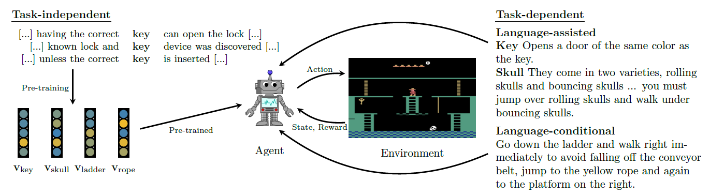

# A Survey of Reinforcement Learning Informed by Natural Language
by [Jelena (2018)](http://arxiv.org/abs/1906.03926)

## 0 Abstract
- 강화학습은 실제 문제 혹은 실제 세계의 문제를 풀기 위해선 조합적, 관계적, 위계적 구조를 활용할 수 있어야 한다.
- 최근 언어에 대한 표상학습 분야의 발전은 텍스트로부터의 지식 추출과 이를 의사결정 문제에 통합하는 것을 가능하게 한다.
- NLU와 강화학습을 통합하는 문제에 대한 연구를 검토한다.

## 1 Introduction
- 자연어 텍스트 자료는 의사결정에 있어 매우 중요하며, 단어나 문장에 대한 뉴럴 임베딩은 transfer learning을 이용하는 NLU 과제에서 성공적으로 쓰이고 있다.
- 최근의 표상학습 분야에서 나타난 발전은 보다 도전적인 목표를 가진 연구자들에게 있어 주목할만 것들이다.
  * Matthew E. Peters, Mark Neumann, Mohit Iyyer, Matt Gardner, Christopher Clark, Kenton Lee, and Luke Zettlemoyer. Deep contextualized word representations. In NAACL, 2018.
  * Jacob Devlin, Ming-Wei Chang, Kenton Lee, and Kristina Toutanova. BERT: Pre-training of Deep Bidirectional Transformers for Language Understanding. arXiv:1810.04805 [cs], 2018.
  * Alec Radford, Jeffrey Wu, Rewon Child, David Luan, Dario Amodei, and Ilya Sutskever. Language models are unsupervised multitask learners. 2019.

## 2 Background
### 2.2 Transfer from Natural Language
- 맥락적 벡터 표상 방법은 언어를 다뤄야 하는 종류의 과제에 지식을 전이할 수 있다는 장점이 있다.
- 언어에 담겨 있는 과제-특정적 지식은 연쇄적 의사결정 문제에 마찬가지로 전이되어 도움이 될 수 있다. (e.g., 네비게이션 과제에서 텍스트 명령어가 도움이 됨)

## 3 Current Use of Natural Language in RL

* Language-conditional RL
  문제를 해결에 있어 에이전트의 언어 사용이 반드시 필요한 경우
- Language-assisted RL
  언어가 학습에 도움되는 방식으로 필요한 경우
### 3.1 Language-conditional RL
- Instruction-following agents 는 상위의 언어 지시문에 정의된 대로 과제를 해결해야 한다.
- 최근에는 주로 언어 임베딩을 이용한 방법들이 많다.
  [Mei et al., 2016; Hermann et al., 2017; Chaplot et al., 2018; Janner et al., 2018; Misra et al., 2017; Chen et al., 2018].
- 위계적 강화학습으로 지시문 일부에 표현된 하위과제를 처리하도록 하는 방식의 연구도 나타났다.
  [Barto and Mahadevan, 2003; Branavan et al., 2010]
- Inverse RL을 이용해 지시문으로부터 보상값을 유추해서 활용하는 방법도 최근 제시되었다.
  [Ziebart et al., 2008; Ho and Ermon, 2016]
- 텍스트 게임과 같은 과제에서 언어를 직접적으로 사용한 관찰 및 갱위공간을 처리하는 방버도 연구되었다.
- QA나 VQA와 같은 과제에서는 언어를 사용해 상호작용을 하는 연구들이 다수 등장하였다.
- Embodied QA (EQA)와 같은 모델에서는 에이전트가 다단계 계획과 추론을 하도록 하는 방법도 제시되었다.

### 3.2 Language-assisted RL
- 주로 언어자료에서 추출된 지식들이 강화학습 과제에 활용된 연구들이 주를 이룬다.
- 한 연구는 '문명'과 같은 게임을 에이전트가 해결하는데 있어서 메뉴얼의 텍스트 정보를 활용하는 방법을 제시하였다. [Branavan et al., 2012]
- [Narasimhan et al., 2018]은 게임에서 등장하는 대상들의 속성을을 주석한 짧은 텍스트를 에이전트가 이용하도록 하였다.
- 네비게이션과 같은 과저에서는 또한 에이전트의 policy를 구조화하는 데에도 언어가 사용될 수도 있다.
- 위계적 강화학습과 같은 모델에서는 자연어의 구조적 속성을 반영하여 거기에 담긴 policy를 표현하는데 쓰일 수 있다.
  [Andreas et al., 2017; Shu et al., 2018]

## 4 Trends for Natural Language in RL
- 큰 경향성
  * Studies for language-conditional RL are more numerous than for language-assisted RL
  * Learning from task-dependent text is more common than learning from taskindependent text
  * Within work studying transfer from task-dependent text, only a handful of papers study how to use unstructured and descriptive text
  * There are only a few papers exploring methods for structuring internal plans and building compositional representations using the structure of language
  * Natural language, as opposed to synthetically generated languages, is still not the standard in research on instruction following.
- 도전 과제
  * 제한되고 인위적인 텍스트가 아니라 사람이 실제 사용하는 언어를 타겟으로 하는 연구들이 더 필요하다.
  * 다양한 환경에 대한 에이전트의 적응력을 키우기 위해서는 실제 세계의 의미정보를 활용할 수 있도록 해야 한다.

### Conclusion
- 현재 강화학습 에이전트가 학습되는 방식은 환경으로부터 직접 주어지는 정보에 의존하는 방식으로 이런 접근법은 학습정보 활용성이 너무 떨어지고 다른 환경에 대한 적응력이 너무 취약하다.
- 강화학습 에이전트에 자연어 정보를 주면서 활용하는 방법은 이러한 약점을 보충하는데 큰 도움이 될 수 있다.
