# Statistics and Samples in Distributional Reinforcement Learning
by [Rowland et al. (2019)](http://arxiv.org/abs/1902.08102)

## 0. Abstraction
* DRL 알고리즘은 통계적 estimator와 통계치에 맞는 기대보상 분포를 imputing 하는 방법의 조합으로 여길 수 있다.
* 분포 강화학습(Distributional RL)에 대한 더 나은 분석법을 제시하고 기대보상 분포의 expectile을 측정하는 방식인 EDRL 알고리즘을 소개한다.
* 몇 가지 실험을 통해 EDRL 방법의 성능을 검증하였고, ER-DQN 알고리즘도 고안하여 아타리 게임환경에 실험하였다.

## 1. Introduction
* 근래 강화학습에서는 기대보상값의 분포에 의한 접근법의 효과가 입증되었고, 이 방법론을 분포 강화학습(Distribution Reinforcement Learning)이라고 부르게 되었다.
* 하지만 DRL 알고리즘을 분석하는 것은 여전히 새롭고 어려운 과제이며, 이 연구에서는 이 알고리즘을 기대보상 분포에 대한 통계치들을 재귀적으로 측정하는 방법으로 조명하는 것을 제안한다.
* **주장:** DRL 알고리즘은 통계적 추정량(estimator)을 imputation 전략이라고 하는 절차와 조합하는 것으로 볼수 있다.
* **Imputation 전략** 이란 통계 추정치들과 정합적인 기대보상 분포를 생성하는 것을 가리킨다.

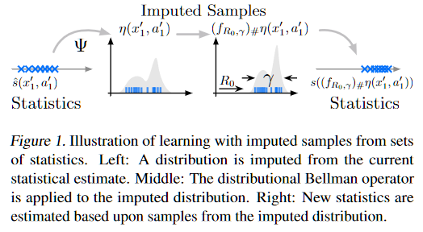

* 이 방법을 통해 다음과 같은 질문에 대답하기를 기대한다.
  1. 제시된 프레임워크를 통해 기존 DRL 방법들을 설명하고, 새로운 알고리즘을 도출해낼 수 있을까?
  2. 어떤 기대보상 분포가 벨만등식을 통해 **정확히** 계산될 수 있는가?
  3. 정확히 얻을 수 없다면, 어떻게 참 값과 별 차이 없는 근사치를 얻을 수 있을까?

## 2. Background
### 2.1 Bellman equations
* 전통적인 벨만 등식과는 달리 DRL에서는 기대보상 값의 분포, $\eta(x,a)_\pi\in \mathcal{P}(\mathbb{R})$가 주어진다고 본다. 이것을 보다 분명하게 표현하면 수식 (3)과 같다.

* $f_{r,\gamma}:\mathbb{R}\rightarrow\mathbb{R}$ 는 $f_{x,\gamma}(x)=r+\gamma x$로 정의된다.
* $g\#\mu \in \mathcal{P}(\mathbb{R})$ 는 $g\#\mu(A)=\mu(g^{-1}(A))$ 이다.
* 수식 (3)은 사실 $\eta_\pi(x,a)$에 따른 분포를 갖는 $\mathbb{Z}^\pi(x,a)$로 해석하면, 아래의 분포적 벨만 등식과 같은 것이다.

* 하지만 분포공간은 거의 무한하므로 실제로는 모수적 접근을 통해 목표 분포를 근사하는 방법을 사용해왔다.

### 2.2 Categorical and quantile distributional RL
* 현재까지 DRL에 대한 주요 접근법은 크게 두 가지로, 하나는 범주적 분포를 학습하는 CD (Categorical Distributions) 접근법이 있었고 다른 하나는 분포 퀀타일을 학습하는 QD (Quantile Distributions) 접근법이 있다.

### CDRL
* CDRL은 기대보상 분포에 대해 범주적 형태를 가정하는 접근법이다.
* $\eta(x,a)=\sum^{K}_{k=1}p_k(x,a)\delta_{z_k}$ 
* 여기에 대한 벨만 업데이트는 아래와 같은 식을 가진다.

* 위 식에서 $\Pi_C:\mathcal{P}(\mathbb{R})\rightarrow \mathcal{P}(\{z_1, \cdots , z_K\})$은 projection operator이다.

### QDRL
* QDRL은 기대보상 분포에 대해 모수적 분포를 가정한다.
* $\eta(x,a)=\frac{1}{K}\sum^{K}_{k=1}\delta_{z_k (x,a)}$
* 여기서 벨만 업데이트는 아톰 위치 $z_k (x,a)$를 목표 분포의 $T_k$-quantile로 이동시키면서 이루어진다.
* 이 과정에서 사용되는 것이 quantile regression loss이다.

## 3. The role of statistics in distributional RL
* DRL을 모수화를 통해 기대보상 분포를 근사시키는 것으로 이해하는 것은 직관적 이해에 도움이 된다.
* DRL을 또한 통계치의 집합으로 보면서 재귀적 근사화 과정으로 보는 관점이 DRL의 깊은 이해와 발전에 도움이 된다.

### 3.1 Expectiles
* QDRL의 영향을 받아, 본 연구에서는 보상기대 분포의 expectile을 학습하는 것을 목표로 삼는다.
* Expectile은 퀀타일이 중위수를 일반화하는 것과 같은 양상으로 평균을 일반화한다.

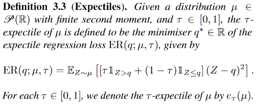

* Expectile regression loss는 오차제곱의 비대칭 버전이다.
* 1/2-expectile은 단순한 평균이다.
* 정의 3.3에 따라 다음의 expectile을 학습할 수 있다: $\tau_1, \cdots, \tau_K \in [0, 1]$
* 그리고 수식 (5)를 통해 분포를 근사한다.

* $\mu=(T^\pi \eta)(x,a)$는 목표 분포이다.
* 하지만 이 알고리즘은 곧바로 적용할 수 없다. 왜냐하면 학습이 진행되면서 분포의 분산이 한 점으로 모이는 현상이 나타나기 때문이다. ([single Dirac](https://en.wikipedia.org/wiki/Dirac_delta_function))
* 그림 2는 이 현상을 잘 보여준다.

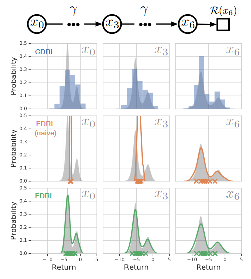

* 우리들이 보기에 이 문제의 본질은 우리가 통계치(statistics)와 샘플의 차이를 구별하지 못하는 데 있다. 수식 (5)의 $z_k(x,a)$는 통계치의 의미로 봐야 하며, 목표 분포의 파리미터는 샘플의 의미로 해석해야 한다.

### 3.2 Imputation strategies
* 만일 모든 각 다음 상태-행위 쌍 *(x',a')* 에 대한 총 보상기대 분포 추정치인 $\eta(x',a')$에 접근 가능하다면, 샘플과 통계치 간의 얽힘(conflation)을 피할 수 있다.
* 이 연구에서 취하는 방법은 중간단계를 추가해서 각 상태-행위 쌍에 대한 측정된 통계치를 정합적인(consistent) 분포, $\eta(x',a')로 변환하는 것이다.

* 이를 정리하면 DRL의 일반 프레임워크가 된다. 이 접근의 요체는 (1) 학습할 통계치 집단을 선택하며, (2) imputation 전략을 선택하고, (3) 수식 (6)을 따라 분포를 업데이트하는 것이다. (알고리즘 1)

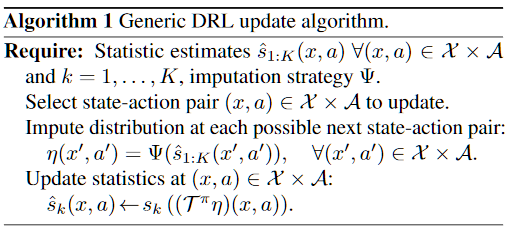

### 3.3 Expectile distributional reinforcement learning
* Imputation 전략에 따라 필요한 expectile 값의 그룹을 얻어야 한다. 그리고 각 expectile에 대한 확률분포를 계산해야 한다.
* 수식 (7)과 (8)에 따라 expectile regression loss를 최소화한다. 수식 (8)은 목표함수가 된다.

### 3.4 Stochastic approximation
* 실제적인 문제에서는 MDP의 복잡성 때문에 수식 (6)을 그대로 적용할 수 없고, 화률적 근사 방법을 써야 한다.
* 상태-행위 상에 대한 추정 통계치 손실함수는 수식 (9)를 통해 표현되며, 이를 이용한 알고리즘 2는 EDRL의 통계적 접근법이 된다.

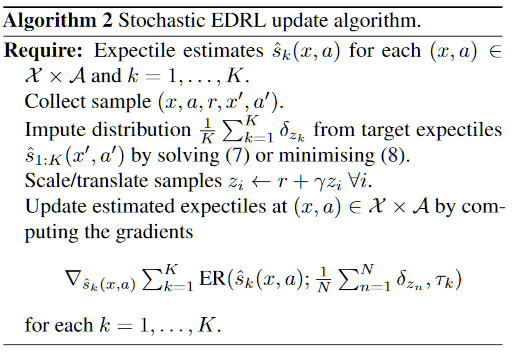

## 4. Analysing distributional RL
### 4.1 Bellman closedness

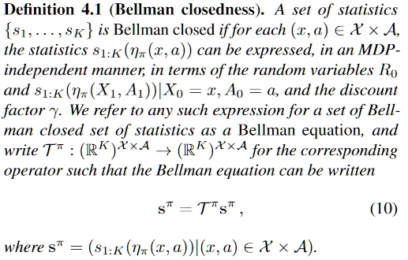

* 정의에 따르면, 평균과 분산과 같은 통계치는 벨만 닫힘성을 갖는다. (Sobel, 1982)
* 만일 통계치 그룹이 벨만 닫힘성을 갖지 못한다면 보상기대 분포에 대한 통계치와 연관되는 벨만 등식이 성립되지 못한다.
* 그러므로 그런 경우를 위해서 그런 통계치 그룹은 벨만 닫힘성을 갖기 위해서 imputation 전략과 같은 방법에 의해 변형되어야 한다.

### 4.3 Mean consistency
* 행위의 통제(control)를 위해선, 보상 기대값(expected returns)을 정확하게 측정하는 것이 매우 중요하다.
* 사전 연구에 의해 CDRL은 보상 기대값에 대한 정확한 측정이 가능하나, QDRL은 그렇지 못하다는 것이 밝혀졌다.
* EDRL의 경우, 1/2-expectile은 평균을 반영하며 통계치 그룹에 속하므로, 보상 기대값을 정확하게 측정한다.

## 5. Experiment results
* 먼저 tabular EDRL 버전을 제시한 후에 DQN 모형에 이를 적용한 ER-DQN 알고리즘으로 아타리-57 게임 문제를 시도하였다.

### 5.1 Tabular policy evaluation
* EDRL 방법은 샘플 imputation 전략을 이용하므로, policy의 참된 expectile 값들을 더 잘 근사할 것이라는 것이 실험가설이다.
* 비교조건은 imputation 전략을 사용하지 않는 naive EDRL 방법이다.
* 실험 환경으로 다소 변형된 15-Chain 환경을 사용한다.(Fig. 3)

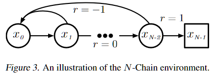

* 이 환경에서 각 상태는 0.95의 확률로 오른쪽으로 이동하거나 0.05의 확률로 $x_0$으로 갈 수 있다.
* 가장 왼쪽의 상태에 가게되면 보상값은 -1을 받게 되고, 가장 우편의 상태는 +1을, 그 외에는 0의 보상값을 받게 된다. 보상값 감쇄율은 0.99를 사용했다.
* 이 문제에서 각 상태에서 최적 policy(항상 우향인)인 정책의 기대보상 분포를 계산하였다. 이 환경에서 어떤 상태의 거리가 목표지점과 멀면 멀수록 그 상태에 대한 policy의 기대보상 분포는 multi-modal 형태를 띠게 된다.
* EDRL 조건에서 SciPy 최적화 루틴을 사용하였고, {1,3,5,7,9} expectile을 학습시켰다. 러닝레이트는 0.05, 학습단계 수는 3만이었다.

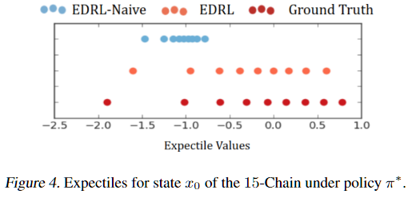

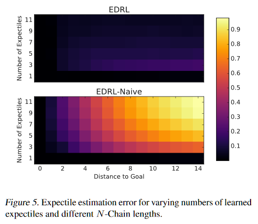

* 그림 5에서 목표점과의 거리가 멀면 멀수록 오차가 증가하는 양상을 EDRL-Naive 조건에서 잘 볼 수 있다. 상대적으로 EDRL 조건을 그렇지 않으며 근사오차가 매우 작음을 볼 수 있다.

$\arg\min_{q\in \mathbb{R}} \mathbb{E}_{Z\sim \mu} [(\tau \mathbf{1}_{Z>q}+(1-\tau)\mathbf{1}_{Z<q})H_\kappa(Z-q)]$ (11)

* 수식 (11)은 Huber-quantile loss를 사용하는 QDRL 방법이다. 여기에 imputation 전략을 응용하면 비슷한 효과를 볼 수 있다. 그림 6은 Huber-QDRL 방법에 대해 그런 전략을 사용한 경우와 그렇지 않은 경우를 비교한 결과이다.

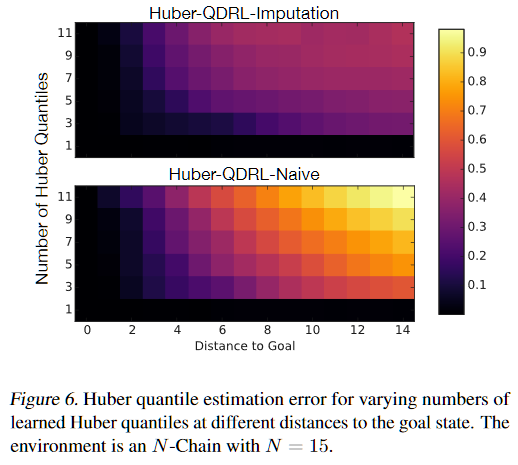

### 5.2 Tabular control
* 그림 7a에서 제시된 간단한 5-상태 MDP 문제를 통해 policy가 직접적으로 mean consistency에 의해 영향을 받는 환경을 만들어 실험하였다.
* 두 종단 상태의 보상값은 치우쳐진 지수함수 분포들, $e^{-\lambda} (\lambda \geq 0)$과 $e^{\lambda+1.85} (\lamda \leq 1.85)$에서 나온다.
* 그림 7b에서 볼 수 있듯이 CDRL과 QDRL은 mean consistency의 부재로 인해 참 평균으로부터 떨어진 측정을 하는 것을 보여준다.

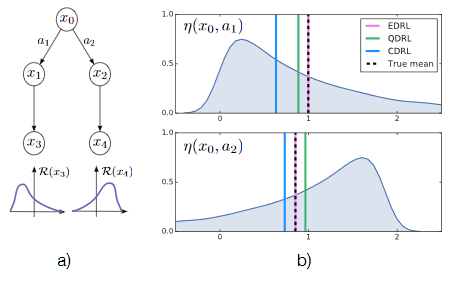

### 5.3 Expectile regression DQN
* 앞서 제시된 알고리즘 2의 EDRL 업데이트와 QR-DQN 아키텍처를 조합한 ER-DQN 모형을 아타리-57 게임 실험세팅에 이용하였다.
* 비교조건은 일반 DQN과 Naive ER-DQN, QR-DQN(200개의 Huber 퀀타일 통계치를 이용)을 사용하였다.
* 모든 조건은 랜덤 시드 3개에 대한 성능의 평균을 취하였다.
* 실험에서 ER-DQN은 11개의 expectile로도 다른 조건들에 비해 좋은 성능을 보였다.

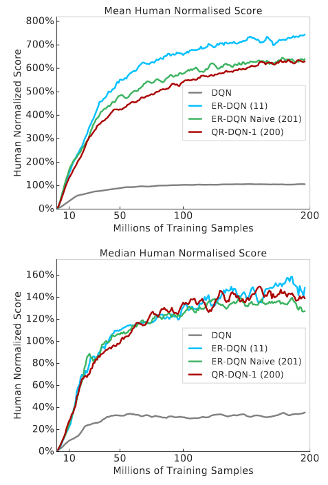

## 6. Conclusion
* 통계적 추정량과 imputation 전략에 따라 분포적 강화학습을 위한 통합적 프레임워크를 제안하였고, EDRL이란 구체적인 알고리즘을 제시하였다.
* Inputation 전략은 매우 다양한 통계치에 적용될 수 있는 가능성이 있다.
* 벨만 닫힘(Bellman closedness)성이 없는 방법들은 측정에 작지 않은 오차를 포함하게 된다는 것을 밝혀냈다.
* 향후에는 implicit qunatile network (Dabney et al., 2018)와 같은 많은 퀀타일을 사용하는 방법에도 적용하여 연구할 것이다.
